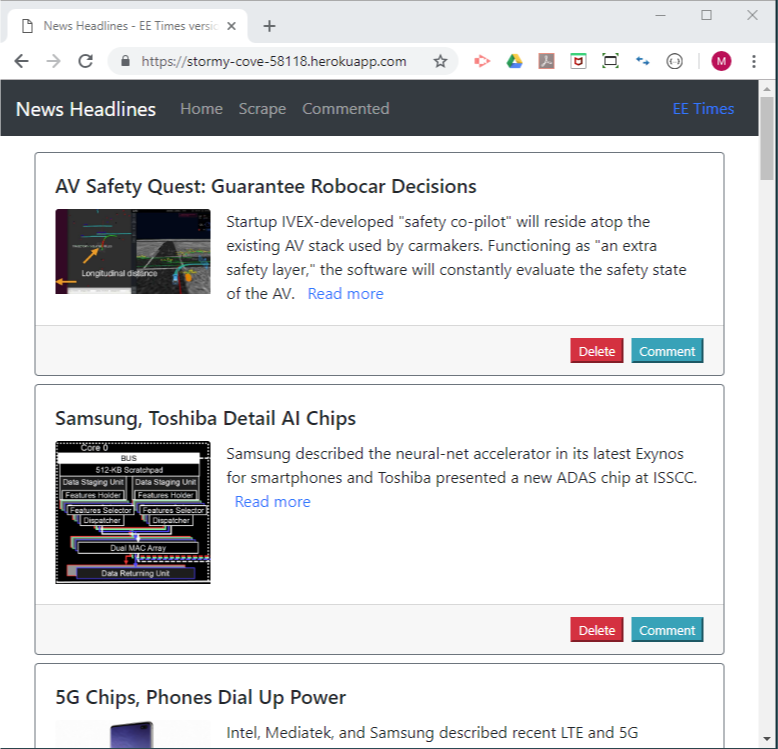
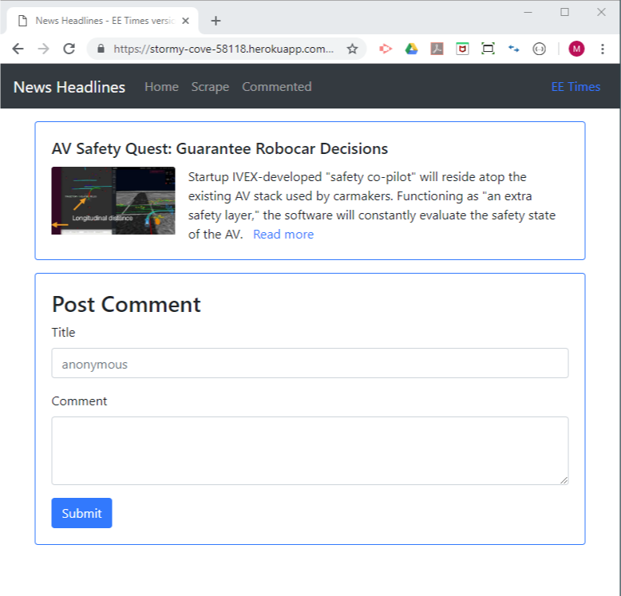
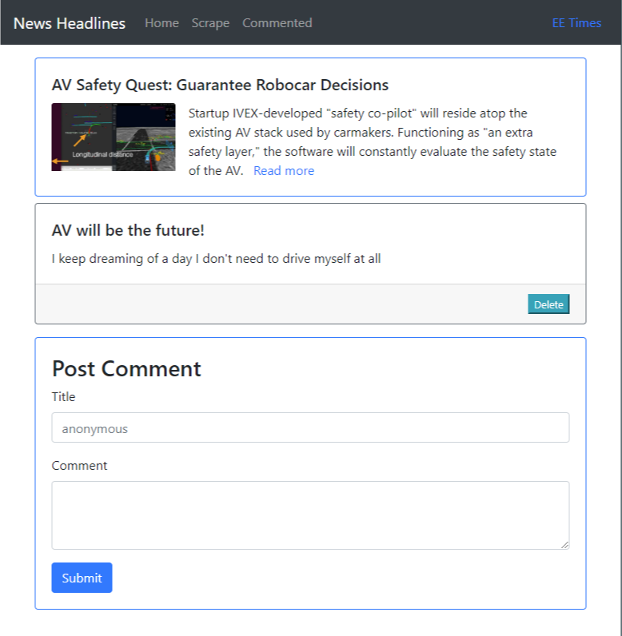

# All the News That's Fit to Scrape

## __News Headlines -- EE Times edition__

## Overview

* News Headlines is a new scraping app that scrapes news articles from a web site
  and display. In this edition, the app will fetch articles from [`EE Times`](https://www.eetimes.com/) and displays the followings:
     * Headline - the title of the article
     * Summary - a short summary of the article
     * URL - the url to the original article
     * Image - an image of the article
     
* Along with each article, there are `Delete` and `Comment` buttons.
  * `Delete` button deletes the article. [Delete from the internal database]
  * `Comment` button lets a user add comment(s) to the article.
    * `Post Comment` form is available at the bottom of page.
    * On the comment page, any existing comments are listed.
    * A new comment will be appended toward the bottom.

## Objectives

* Implement the app with MVC Restful API using `Node.js`, `Express`, and `Handlebars`
* Utilize `MongoDB` and `Mongoose ODM` including multiple tables and relations
* Scrape an external web site for news articles using `cheerio` and `axios`

### Deployment and Availability

* Heroku
  * Live app - https://stormy-cove-58118.herokuapp.com/
* GitHub
  * Repository - https://github.com/mmakino/NewsHeadlines

### Intallation

* This full stack app can also be installed __locally__ through the following steps 

1. Clone the git repository
    ```
    git clone https://github.com/mmakino/NewsHeadlines.git
    ```
1. Install necessary packages
    ```
    npm install
    ```
    * This app uses the following NPM packages:
    ```
    "axios": "^0.18.0",
    "cheerio": "^1.0.0-rc.2",
    "express": "^4.16.4",
    "express-handlebars": "^3.0.1",
    "mongoose": "^5.4.15"
    ```
1. MongoDB database
    * MongoDB server `mongod` needs to be up and running with all CRUD privileges.
    * `models/index.js` includes the default setup
       * mongodb://localhost/newsHeadlines
    ```
    models/
    └── index.js
    ```
    * Default setting
        * HOST: localhost
        * PORT: 3003
1. Start the web server
    ```
    node run server
    ```
    * It should display the following message when the server has started successfully
      ```
      ...
      ...
      App running on port 3003!
      Connected to MongoDB mongodb://localhost/newsHeadlines
      ```
1. Open the web page in a browser by entering the following URL into the address bar.
    ```
    http://localhost:3003/
    ```

### Demo

* The main page displays `scraped articles` from [EE Times](https://www.eetimes.com/)

   [](https://stormy-cove-58118.herokuapp.com/)
   
* Pressing the `Delete` button of each article will delete the article.

* The `Scrape` button on the navbar on top will fetch and (re-)populate articles.

* Pressing the `Comment` button of each article will take a user to an individual article page with comments (if already any). A user can post a comment using the `Post Comment` form at the bottom of the page.

   [](https://stormy-cove-58118.herokuapp.com/)
   
* A comment can be deleted by pressing the `Delete` button for each comment.

   [](https://stormy-cove-58118.herokuapp.com/)

* The `Commented` button on the navbar will display only articles that have been commented.


#### Written by [Motohiko Makino](https://mmakino.github.io/)

